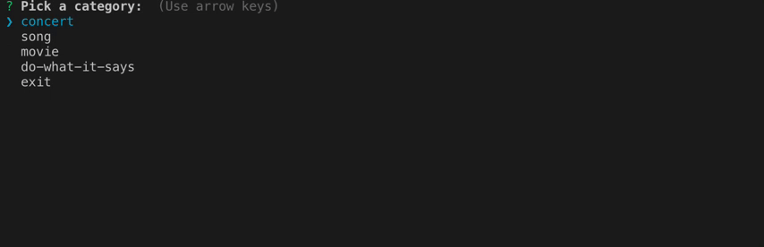
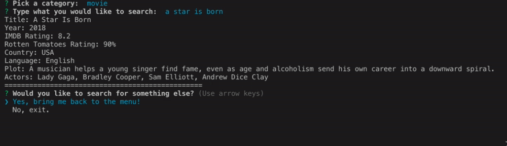

# Liri

## About Liri

LIRI is like iPhone's SIRI. However, while SIRI is a Speech Interpretation and Recognition Interface, LIRI is a Language Interpretation and Recognition Interface. LIRI will be a command line node app that takes in parameters and gives you back data.

## How to use Liri

1. Type this command in your terminal:
   `node liri.js`

2. Make sure you have all the packages installed! You may do so by typing this command in your terminal: `npm i`

3. Users can pick one from one of the following categories, then type in what you would like to search.

- ### Search for a concert ([Bandsintown](https://manager.bandsintown.com/support/bandsintown-api)):

Enter the artist(s) name, and the following information will be displayed:

- Name of the venue
- Venue location
- Date of the Event

- ### Search for a song ([Spotify](https://developer.spotify.com/documentation/web-api/))

Enter the name of the song, and the following information will be displayed:

- Artist(s)
- The song's name
- A preview link of the song from Spotify
- The album that the song is from

- ### Search for a movie ([OMDb](http://www.omdbapi.com/))

Enter the title of a movie, and the following information will be displayed:

- Title of the movie
- Year the movie came out
- IMDB Rating of the movie
- Rotten Tomatoes Rating of the movie
- Country where the movie was produced
- Language of the movie
- Plot of the movie
- Actors in the movie

- ### Do what it says!
Try it!

- ### Reset

After each search, you can choose to search for something else or exit the app.

## Resources:

### APIs:

- [OMDb API](http://www.omdbapi.com/)
- [Bandsintown](https://manager.bandsintown.com/support/bandsintown-api)
- [Spotify](https://developer.spotify.com/documentation/web-api/)

### Node Packages:

- [axios](https://www.npmjs.com/package/axios)
- [dotenv](https://www.npmjs.com/package/dotenv)
- [inquirer](https://www.npmjs.com/package/inquirer)
- [moment](https://www.npmjs.com/package/moment)
- [node-spotify-api](https://www.npmjs.com/package/node-spotify-api)
